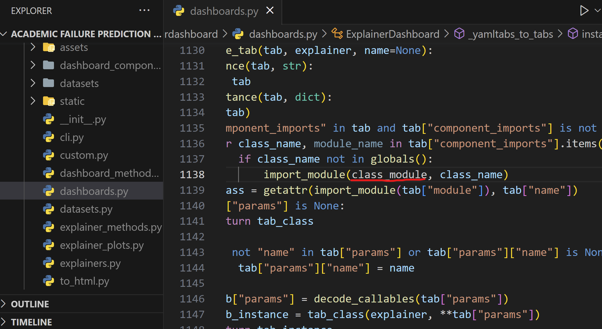
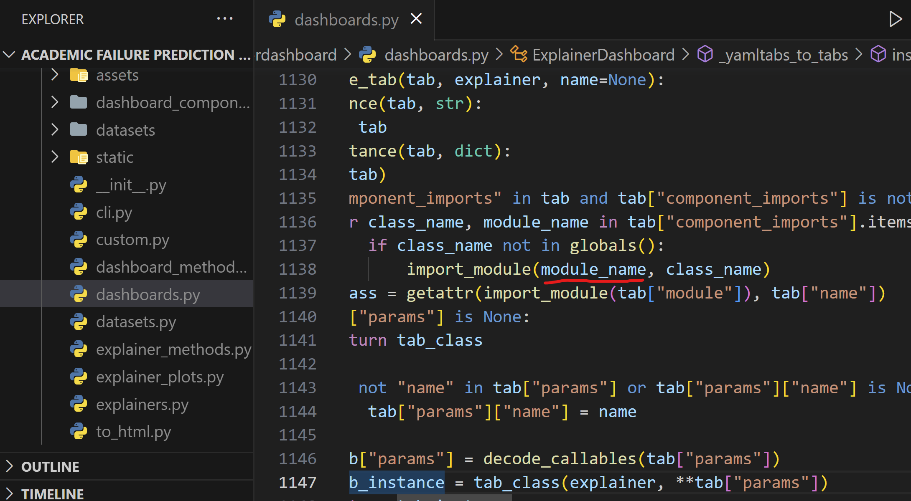
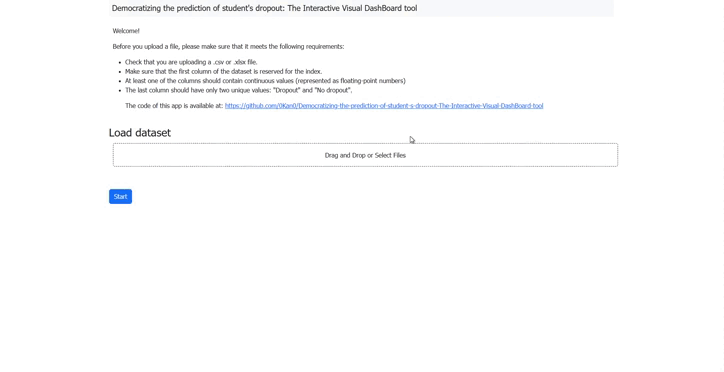
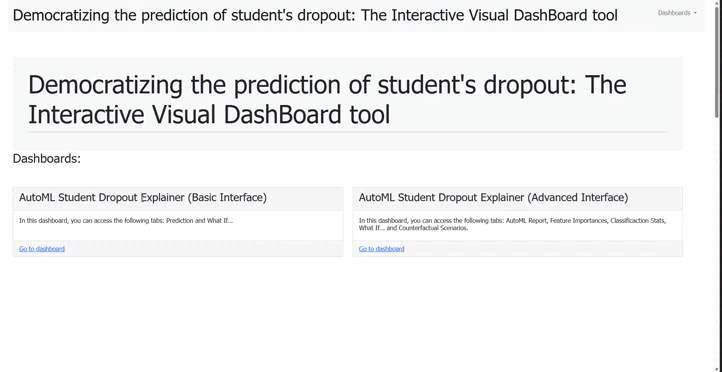

# Democratizing the prediction of student's dropout: The Interactive Visual DashBoard tool
This python app allows the user to upload a dataset of students and, with zero knowledge of machine learning, generate the best posible model, see performance graphs and metrics, and make predictions of these students. Making this predictions gives the possibility to detect which are the causes that makes a student to dropout, allowing the user to use this information to help future students.

It is worth noting the use of these packages:
  - [explainerdashboard](https://github.com/oegedijk/explainerdashboard) by [Oege Dijk](https://github.com/oegedijk):
    This package makes it convenient to quickly deploy a dashboard web app that explains the workings of a (scikit-learn compatible) machine learning model. The dashboard provides interactive plots on model      performance, feature importances, feature contributions to individual predictions, "what if" analysis, partial dependence plots, SHAP (interaction) values, visualisation of individual decision trees, etc. 
    
    It uses the framework Dash that ties modern UI elements like dropdowns, sliders, and graphs directly to your analytical Python code.
  
  - [mljar-supervised](https://github.com/mljar/mljar-supervised) by [MLJAR](https://github.com/mljar): 
    The mljar-supervised is an Automated Machine Learning Python package that works with tabular data. It is designed to save time for a data scientist. It abstracts the common way to preprocess the data, construct the machine learning models, and perform hyper-parameters tuning to find the best model 
    

  - [DiCE](https://github.com/interpretml/DiCE) by [InterpretML](https://github.com/interpretml):
    DiCE is a Python package that implements [counterfactual (CF) explanations](https://arxiv.org/abs/1711.00399), which offer information on how to change the input features to obtain a different output from the model. These explanations show feature-perturbed versions of the same person or entity, which would have resulted in a different outcome. In other words, DiCE provides "what-if" explanations for model output. This approach can be a useful complement to other explanation methods, both for end-users and model developers.

# Requirements
  - Python 3.9 or Python 3.10

# Installation
  1. Download this repository or clone it using `git clone https://github.com/0Kan0/Democratizing-the-prediction-of-student-s-dropout-The-Interactive-Visual-DashBoard-tool.git`.
  2. Access the downloaded folder. (Optional: Create a virtual environment and activate it).
  3. Install the required packages by running `pip install -r requirements.txt`. 
  4. Once the installation has ended, access to where the packages are installed, access explainerdashboard folder and open dashboards.py. There you should change this line of code in order for this app     to work:
  

  
  &nbsp; &nbsp; &nbsp; &nbsp;
  
  

# Usage
  5. Access src folder and run `python index.py`. This will open your web browser and redirect to the home screen. If it doesn't, navigate to http://localhost:8080.
  6. Follow the instrunctions provided in the home screen on the file before uploading it.
  7. Upload a dataset file.
  8. Press "Start" buttton.
  9. Wait for the process to finish. You can check it in the terminal (note that depending of the size of the dataset and how good your computer is, the process will take more or less). The AutoML model of the dataset will be saved in the [saved_AutoML_models](saved_AutoML_models/). If the same dataset is uploaded, the model will be loaded instead of training a new one.
  10. If all went correctly, a "Go to dashboard" button should appear below the "Start" button. Click it and that will open a new tab with the dashboard hub (in case it didn't redirect, navigate to                  http://127.0.0.1:8050).
  11. If you want load a new dataset, go to the terminal and end the process with Ctrl+C. Then open it again with `python index.py`.

# Home page

# Dashboard hub

There will be 2 dashboards we can see in the hub:
  - AutoML Student Dropout Explainer (Basic Interface): Focused for those that have no knowledge about machine learning. In this dashboard you can acces the "Predictions" tab and "What If" tab.
  - AutoML Student Dropout Explainer (Advanced Interface): Focused for those that have knowledge about machine learning. In addition of what was already in the other dashboard, here you can check all models that were tested by AutoML and which one was the best, as well as different graphs and metrics of the performance of the best model used. Apart from this, you can access the "Counterfactuals" tab to generate counterfactuals explanations.

# Link to the paper
[Easing the Prediction of Student Dropout for everyone integration AutoML and Explainable Artificial Intelligence](https://educationaldatamining.org/edm2024/proceedings/2024.EDM-posters.98/)
